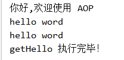

# 使用 spring-boot-stater-aop 实现接口访问日志

本案例使用 `@annotation` 和重用切点 `@PointCut` 实现的方式实现接口访问日志

这种方式应该类似于 `@Transaction` 方式，这个切面可以应用到任意位置，而不是需要通过通知上的切点表达式设置切面


maven 引入，如果只引入 spring-aop 的话，还需要引入其它依赖，比如 `anotation-apo`,否则没有 `@Aspect` 等注解，这里就看出了 springboot 的 starter 的作用

使用 springboot 不用手动开启代理功能 `@EnableAspectJAutoProxy`，springboot 中默认为 true

注意：

- LogAspect 需要有 `@Component` 注解，它必须是一个由 spring 注入的 bean。

引入 maven 依赖

```xml
<dependency>
    <groupId>org.springframework.boot</groupId>
    <artifactId>spring-boot-starter-aop</artifactId>
</dependency>
```

定义注解

```java
@Target(ElementType.METHOD)
public @interface LogJoinPoint {
    String value() default "default";
}
```

定义切面

```java
@Aspect
@Component
public class LogAspect {

    @Pointcut("@annotation(wang.chunfan.springbootdemo.aop.anotation.LogJoinPoint)")
    public void logPointcut() {

    }

    @Around("logPointcut()")
    public void around(ProceedingJoinPoint joinPoint) throws Throwable {
        MethodSignature methodSignature = (MethodSignature) joinPoint.getSignature();
        Method method = methodSignature.getMethod();
        try {
            Object object = joinPoint.proceed();
            System.out.println(method.getName() + " 执行完毕！");
            //return "你好";
        } catch (Exception ex) {
            System.out.println(method.getName() + " 执行失败！");
            throw ex;
        }
    }
}
```

定义 controller，在 get 方法中调用 getHello() 方法是不会触发通知的，因为在方法内部没有使用代理,而在浏览器中访问的是代理类。

```java
@RestController
public class HelloController {

    @GetMapping("hello")
    @LogJoinPoint
    public String getHello() {
        return "hello word!";
    }

    @GetMapping
    public String get() {
        getHello();
        return "你好,欢迎使用 AOP";
    }
}
```

先访问 `http://localhost:8080/` ，再访问 `http://localhost:8080/hello`



